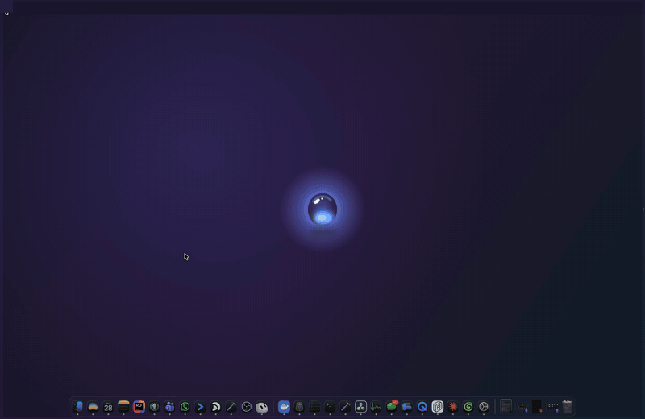

# Contador

<p align="center"></p>

Uma gota de vidro líquido presa na borda da tela do seu Mac, contando o tempo até a sua meta.
Passe o mouse e ela se estica mostrando dias, horas, progresso e semanas. Tire o mouse e ela volta pra borda.

**Arranque e jogue em qualquer borda.** Com a gota aberta, clique e arraste: ela se estica, descola e vira uma bolha. Solte e ela voa com gravidade: jogou forte, gruda onde mirou; jogou fraco, cai e gruda embaixo. Jogue no notch e ela envolve o notch como líquido.

<p align="center"></p>

<p align="center"><a href="docs/showcase.mp4">Ver em vídeo (MP4)</a></p>

[English below](#english)

## Instalar

Cole no Terminal:

```sh
curl -fsSL https://raw.githubusercontent.com/AdrianoBinhara/contador/main/install.sh | sh
```

Pronto. A gota nasce no centro da tela e escorre até a borda.

Prefere baixar? Pegue o `Contador.zip` em [Releases](https://github.com/AdrianoBinhara/contador/releases/latest), descompacte e arraste pra Aplicativos. O app é assinado e notarizado pela Apple, abre sem aviso.

**Requisitos:** macOS 14 ou mais novo, Apple Silicon ou Intel. O vidro líquido aparece no macOS 26; nas versões anteriores a gota usa vidro fosco.

## Usar

- **Ajustes:** clique no card aberto, no ícone de gota na barra de menus ou abra o app de novo pelo Spotlight.
- **Contagem:** nome, início e fim. Reinicie quando quiser ou trave pra evitar clique acidental. Se o início ainda não chegou, ela conta até começar.
- **Mudar de lugar:** arraste a gota aberta e jogue em qualquer borda. Ou escolha borda e posição nos ajustes.
- **Aparência:** 5 cores.
- **Abrir ao iniciar o Mac:** um botão nos ajustes.
- **Atualizações:** quando sair versão nova, aparece "Atualizar" no menu e nos ajustes.
- **Sair:** ícone de gota na barra de menus, "Sair do Contador".

## English

A liquid glass drop stuck to the edge of your Mac screen, counting down to your goal. Hover and it stretches out showing days, hours, progress and weeks.

**Install:** paste in Terminal:

```sh
curl -fsSL https://raw.githubusercontent.com/AdrianoBinhara/contador/main/install.sh | sh
```

Or download `Contador.zip` from [Releases](https://github.com/AdrianoBinhara/contador/releases/latest) and drag it to Applications. Signed and notarized by Apple.

- **Settings:** click the expanded card, the drop icon in the menu bar, or open the app again from Spotlight.
- **Countdown:** name, start and end. Restart anytime, or lock it against accidental clicks.
- **Move it:** drag the open drop off the edge and throw it at any edge: right, left, top or bottom.
- **Look:** 5 colors.
- **Updates:** an "Update" button shows up when a new version is out.

The app follows your Mac's language: Portuguese or English. Requires macOS 14+, Apple Silicon or Intel.

## Compilar / Build

Um único arquivo Swift, sem dependências. *One Swift file, no dependencies.*

```sh
swift icon.swift   # gera/generates Icon.icns
./build.sh         # compila universal e assina / universal build + sign
```

O `build.sh` assina com o Developer ID do autor. Pra compilar na sua máquina, troque a identidade no `codesign` por `-`.
*`build.sh` signs with the author's Developer ID. To build locally, replace the `codesign` identity with `-`.*

## Licença / License

MIT
